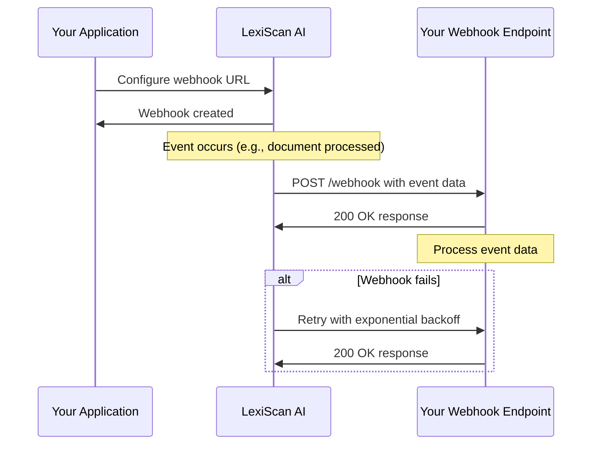

# Webhooks Guide

## Overview

LexiScan AI provides comprehensive webhook functionality for real-time event notifications. This guide covers webhook configuration, event types, security, and best practices for implementing reliable webhook endpoints.

## Table of Contents

- [Webhook Overview](#webhook-overview)
- [Event Types](#event-types)
- [Security](#security)
- [Implementation](#implementation)
- [Testing](#testing)
- [Troubleshooting](#troubleshooting)
- [Best Practices](#best-practices)

## Webhook Overview

### What are Webhooks?

Webhooks are HTTP callbacks that notify your application when specific events occur in LexiScan AI. Instead of polling for updates, you receive real-time notifications about:

- Document processing completion
- User account changes
- Subscription updates
- System events
- Analysis results

### Webhook Flow



## Event Types

### Document Events

| Event | Description | Payload |
|-------|-------------|---------|
| `document.uploaded` | Document uploaded successfully | Document metadata |
| `document.processing` | Document analysis started | Analysis configuration |
| `document.processed` | Document analysis completed | Analysis results |
| `document.failed` | Document processing failed | Error details |
| `document.deleted` | Document deleted | Document ID |

### User Events

| Event | Description | Payload |
|-------|-------------|---------|
| `user.created` | New user registered | User profile |
| `user.updated` | User profile updated | Updated fields |
| `user.deleted` | User account deleted | User ID |
| `user.login` | User logged in | Login details |
| `user.logout` | User logged out | Session info |

### Subscription Events

| Event | Description | Payload |
|-------|-------------|---------|
| `subscription.created` | New subscription | Subscription details |
| `subscription.updated` | Subscription changed | Updated fields |
| `subscription.canceled` | Subscription canceled | Cancellation details |
| `subscription.renewed` | Subscription renewed | Renewal details |
| `payment.succeeded` | Payment processed | Payment info |
| `payment.failed` | Payment failed | Error details |

### System Events

| Event | Description | Payload |
|-------|-------------|---------|
| `system.maintenance` | Maintenance scheduled | Maintenance details |
| `system.alert` | System alert | Alert details |
| `api.rate_limit` | Rate limit exceeded | Usage statistics |
| `security.breach` | Security incident | Incident details |

## Security

### HMAC Signature Verification

All webhook requests include an HMAC signature for verification:

```javascript
const crypto = require('crypto');

function verifyWebhookSignature(payload, signature, secret) {
  const expectedSignature = crypto
    .createHmac('sha256', secret)
    .update(payload, 'utf8')
    .digest('hex');
  
  return crypto.timingSafeEqual(
    Buffer.from(signature, 'hex'),
    Buffer.from(expectedSignature, 'hex')
  );
}

// Express.js example
app.post('/webhook', express.raw({type: 'application/json'}), (req, res) => {
  const signature = req.headers['x-lexiscan-signature'];
  const payload = req.body;
  
  if (!verifyWebhookSignature(payload, signature, process.env.WEBHOOK_SECRET)) {
    return res.status(401).send('Invalid signature');
  }
  
  // Process webhook
  res.status(200).send('OK');
});
```

### IP Whitelisting

LexiScan AI webhooks are sent from specific IP ranges:

```
# Production IPs
52.1.2.3/24
52.1.2.4/24

# Staging IPs  
52.1.3.3/24
52.1.3.4/24
```

### SSL/TLS Requirements

- All webhook endpoints must use HTTPS
- Valid SSL certificate required
- TLS 1.2 or higher recommended

## Implementation

### 1. Webhook Configuration

```javascript
// Create webhook
const webhook = await fetch('https://api.lexiscan.ai/webhooks', {
  method: 'POST',
  headers: {
    'Authorization': 'Bearer your-jwt-token',
    'Content-Type': 'application/json'
  },
  body: JSON.stringify({
    url: 'https://your-app.com/webhooks/lexiscan',
    events: [
      'document.processed',
      'user.created',
      'subscription.updated'
    ],
    secret: 'your-webhook-secret',
    active: true
  })
});
```

### 2. Webhook Endpoint Implementation

#### Express.js Example

```javascript
const express = require('express');
const crypto = require('crypto');
const app = express();

// Middleware to capture raw body
app.use('/webhooks', express.raw({type: 'application/json'}));

app.post('/webhooks/lexiscan', (req, res) => {
  try {
    // Verify signature
    const signature = req.headers['x-lexiscan-signature'];
    const payload = req.body;
    
    if (!verifySignature(payload, signature)) {
      return res.status(401).send('Invalid signature');
    }
    
    // Parse event
    const event = JSON.parse(payload);
    
    // Process event
    handleWebhookEvent(event);
    
    res.status(200).send('OK');
  } catch (error) {
    console.error('Webhook error:', error);
    res.status(500).send('Internal Server Error');
  }
});

function verifySignature(payload, signature) {
  const secret = process.env.WEBHOOK_SECRET;
  const expectedSignature = crypto
    .createHmac('sha256', secret)
    .update(payload, 'utf8')
    .digest('hex');
  
  return crypto.timingSafeEqual(
    Buffer.from(signature, 'hex'),
    Buffer.from(expectedSignature, 'hex')
  );
}

function handleWebhookEvent(event) {
  switch (event.type) {
    case 'document.processed':
      handleDocumentProcessed(event.data);
      break;
    case 'user.created':
      handleUserCreated(event.data);
      break;
    case 'subscription.updated':
      handleSubscriptionUpdated(event.data);
      break;
    default:
      console.log('Unknown event type:', event.type);
  }
}

function handleDocumentProcessed(data) {
  console.log('Document processed:', data.documentId);
  // Update your database, send notifications, etc.
}

function handleUserCreated(data) {
  console.log('New user created:', data.user.email);
  // Send welcome email, create user profile, etc.
}

function handleSubscriptionUpdated(data) {
  console.log('Subscription updated:', data.subscriptionId);
  // Update billing status, adjust permissions, etc.
}
```

#### Node.js with Fastify Example

```javascript
const fastify = require('fastify')({ logger: true });

fastify.post('/webhooks/lexiscan', {
  config: {
    rawBody: true
  }
}, async (request, reply) => {
  const signature = request.headers['x-lexiscan-signature'];
  const payload = request.body;
  
  if (!verifySignature(payload, signature)) {
    return reply.status(401).send('Invalid signature');
  }
  
  const event = JSON.parse(payload);
  await processWebhookEvent(event);
  
  return { status: 'OK' };
});

async function processWebhookEvent(event) {
  // Process event asynchronously
  await eventProcessor.process(event);
}
```

#### Python Flask Example

```python
from flask import Flask, request, jsonify
import hmac
import hashlib
import json

app = Flask(__name__)

@app.route('/webhooks/lexiscan', methods=['POST'])
def webhook():
    # Get signature from headers
    signature = request.headers.get('X-LexiScan-Signature')
    payload = request.get_data()
    
    # Verify signature
    if not verify_signature(payload, signature):
        return 'Invalid signature', 401
    
    # Parse event
    event = json.loads(payload)
    
    # Process event
    handle_webhook_event(event)
    
    return 'OK', 200

def verify_signature(payload, signature):
    secret = os.environ['WEBHOOK_SECRET']
    expected_signature = hmac.new(
        secret.encode('utf-8'),
        payload,
        hashlib.sha256
    ).hexdigest()
    
    return hmac.compare_digest(signature, expected_signature)

def handle_webhook_event(event):
    event_type = event['type']
    data = event['data']
    
    if event_type == 'document.processed':
        handle_document_processed(data)
    elif event_type == 'user.created':
        handle_user_created(data)
    # Add more event handlers as needed
```

### 3. Event Processing

#### Event Structure

```json
{
  "id": "evt_1234567890",
  "type": "document.processed",
  "created": "2024-01-15T10:30:00Z",
  "data": {
    "documentId": "doc_1234567890",
    "status": "completed",
    "analysisResults": {
      "summary": "Contract analysis completed",
      "riskLevel": "medium",
      "keyFindings": [
        {
          "type": "risk",
          "description": "Missing termination clause",
          "severity": "high"
        }
      ]
    }
  },
  "tenantId": "tenant_1234567890"
}
```

#### Event Processing Queue

```javascript
const Queue = require('bull');
const webhookQueue = new Queue('webhook processing');

// Add event to queue
webhookQueue.add('process-event', event, {
  attempts: 3,
  backoff: {
    type: 'exponential',
    delay: 2000
  }
});

// Process events
webhookQueue.process('process-event', async (job) => {
  const event = job.data;
  
  try {
    await processEvent(event);
    console.log(`Processed event ${event.id}`);
  } catch (error) {
    console.error(`Failed to process event ${event.id}:`, error);
    throw error; // Will trigger retry
  }
});
```

## Testing

### 1. Webhook Testing Endpoint

```javascript
// Test webhook endpoint
app.post('/webhooks/test', async (req, res) => {
  const { webhookId, eventType } = req.body;
  
  const testEvent = {
    id: 'test_' + Date.now(),
    type: eventType,
    created: new Date().toISOString(),
    data: generateTestData(eventType)
  };
  
  await sendTestWebhook(webhookId, testEvent);
  res.json({ status: 'Test webhook sent' });
});

function generateTestData(eventType) {
  switch (eventType) {
    case 'document.processed':
      return {
        documentId: 'test_doc_123',
        status: 'completed',
        analysisResults: {
          summary: 'Test analysis completed',
          riskLevel: 'low'
        }
      };
    case 'user.created':
      return {
        userId: 'test_user_123',
        email: 'test@example.com',
        firstName: 'Test',
        lastName: 'User'
      };
    default:
      return { test: true };
  }
}
```

### 2. Webhook Validation

```javascript
// Validate webhook endpoint
async function validateWebhook(url, secret) {
  const testPayload = JSON.stringify({ test: true });
  const signature = crypto
    .createHmac('sha256', secret)
    .update(testPayload)
    .digest('hex');
  
  try {
    const response = await fetch(url, {
      method: 'POST',
      headers: {
        'Content-Type': 'application/json',
        'X-LexiScan-Signature': signature
      },
      body: testPayload
    });
    
    return {
      valid: response.ok,
      status: response.status,
      response: await response.text()
    };
  } catch (error) {
    return {
      valid: false,
      error: error.message
    };
  }
}
```

### 3. Webhook Monitoring

```javascript
class WebhookMonitor {
  constructor() {
    this.events = [];
    this.failures = [];
  }
  
  logEvent(event) {
    this.events.push({
      ...event,
      timestamp: Date.now()
    });
  }
  
  logFailure(event, error) {
    this.failures.push({
      event,
      error: error.message,
      timestamp: Date.now()
    });
  }
  
  getStats() {
    const total = this.events.length;
    const failed = this.failures.length;
    const successRate = ((total - failed) / total) * 100;
    
    return {
      total,
      failed,
      successRate: successRate.toFixed(2) + '%',
      recentFailures: this.failures.slice(-10)
    };
  }
}
```

## Troubleshooting

### Common Issues

1. **Webhook not receiving events**
   - Check webhook URL is accessible
   - Verify SSL certificate is valid
   - Check firewall/network configuration

2. **Invalid signature errors**
   - Verify webhook secret is correct
   - Check signature generation algorithm
   - Ensure raw body is used for signature

3. **Timeout errors**
   - Optimize webhook endpoint performance
   - Implement async processing
   - Check server response times

4. **Duplicate events**
   - Implement idempotency checks
   - Use event IDs for deduplication
   - Store processed event IDs

### Debug Mode

```javascript
// Enable webhook debugging
process.env.DEBUG = 'lexiscan:webhooks';

// Log all webhook events
app.use('/webhooks', (req, res, next) => {
  console.log('Webhook received:', {
    headers: req.headers,
    body: req.body,
    timestamp: new Date().toISOString()
  });
  next();
});
```

### Webhook Health Check

```javascript
// Health check endpoint
app.get('/webhooks/health', (req, res) => {
  const health = {
    status: 'healthy',
    timestamp: new Date().toISOString(),
    uptime: process.uptime(),
    memory: process.memoryUsage(),
    events: webhookMonitor.getStats()
  };
  
  res.json(health);
});
```

## Best Practices

### 1. Idempotency

```javascript
// Store processed event IDs
const processedEvents = new Set();

function isEventProcessed(eventId) {
  return processedEvents.has(eventId);
}

function markEventProcessed(eventId) {
  processedEvents.add(eventId);
}

function handleWebhookEvent(event) {
  if (isEventProcessed(event.id)) {
    console.log(`Event ${event.id} already processed`);
    return;
  }
  
  // Process event
  processEvent(event);
  markEventProcessed(event.id);
}
```

### 2. Error Handling

```javascript
function handleWebhookEvent(event) {
  try {
    processEvent(event);
  } catch (error) {
    console.error('Webhook processing failed:', error);
    
    // Log error for monitoring
    errorLogger.log({
      eventId: event.id,
      error: error.message,
      stack: error.stack
    });
    
    // Don't throw - return 200 to prevent retries
  }
}
```

### 3. Async Processing

```javascript
// Process webhooks asynchronously
const webhookQueue = new Queue('webhook processing');

app.post('/webhooks/lexiscan', (req, res) => {
  // Verify signature
  if (!verifySignature(req.body, req.headers['x-lexiscan-signature'])) {
    return res.status(401).send('Invalid signature');
  }
  
  // Add to queue for processing
  webhookQueue.add('process-webhook', req.body);
  
  // Respond immediately
  res.status(200).send('OK');
});
```

### 4. Monitoring and Alerting

```javascript
// Webhook monitoring
class WebhookMonitor {
  constructor() {
    this.metrics = {
      totalEvents: 0,
      successfulEvents: 0,
      failedEvents: 0,
      averageProcessingTime: 0
    };
  }
  
  recordEvent(success, processingTime) {
    this.metrics.totalEvents++;
    
    if (success) {
      this.metrics.successfulEvents++;
    } else {
      this.metrics.failedEvents++;
    }
    
    this.metrics.averageProcessingTime = 
      (this.metrics.averageProcessingTime + processingTime) / 2;
  }
  
  getSuccessRate() {
    return (this.metrics.successfulEvents / this.metrics.totalEvents) * 100;
  }
}
```

## Support

For webhook issues:

- **Email**: webhook-support@lexiscan.ai
- **Documentation**: https://docs.lexiscan.ai/webhooks
- **Status Page**: https://status.lexiscan.ai
- **Emergency**: support@lexiscan.ai

## Changelog

| Version | Date | Changes |
|---------|------|---------|
| 1.0.0 | 2024-01-15 | Initial webhook implementation |
| 1.1.0 | 2024-01-20 | Added HMAC signature verification |
| 1.2.0 | 2024-01-25 | Enhanced retry mechanisms |
| 1.3.0 | 2024-02-01 | Added webhook testing tools |
