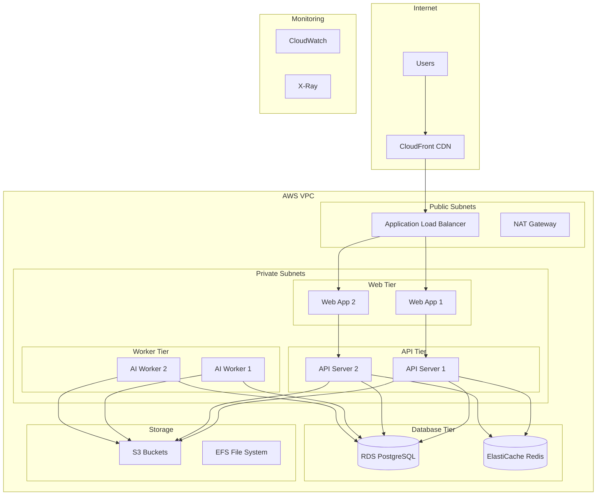

# AWS Deployment Guide

## Overview

This guide covers deploying LexiScan AI on Amazon Web Services (AWS) using modern cloud-native practices. The deployment includes auto-scaling, high availability, security, and monitoring.

## Table of Contents

- [Architecture Overview](#architecture-overview)
- [Prerequisites](#prerequisites)
- [Infrastructure Setup](#infrastructure-setup)
- [Application Deployment](#application-deployment)
- [Database Setup](#database-setup)
- [Monitoring & Logging](#monitoring--logging)
- [Security Configuration](#security-configuration)
- [Scaling & Performance](#scaling--performance)
- [Backup & Recovery](#backup--recovery)
- [Troubleshooting](#troubleshooting)

## Architecture Overview

### High-Level Architecture



### Component Overview

| Component | Service | Purpose |
|-----------|---------|---------|
| **Load Balancer** | Application Load Balancer | Traffic distribution, SSL termination |
| **Web Application** | ECS Fargate | Next.js frontend application |
| **API Server** | ECS Fargate | NestJS backend API |
| **AI Workers** | ECS Fargate | Python AI/ML processing |
| **Database** | RDS PostgreSQL | Primary data storage |
| **Cache** | ElastiCache Redis | Session storage, caching |
| **File Storage** | S3 | Document storage, static assets |
| **CDN** | CloudFront | Global content delivery |
| **Monitoring** | CloudWatch | Metrics, logs, alerts |
| **Tracing** | X-Ray | Distributed tracing |

## Prerequisites

### AWS Account Setup

1. **AWS Account** with appropriate permissions
2. **AWS CLI** configured with credentials
3. **Terraform** for infrastructure as code
4. **Docker** for container builds
5. **kubectl** for Kubernetes management

### Required AWS Services

- **ECS** (Elastic Container Service)
- **RDS** (Relational Database Service)
- **ElastiCache** (Redis)
- **S3** (Simple Storage Service)
- **CloudFront** (CDN)
- **Route 53** (DNS)
- **Certificate Manager** (SSL/TLS)
- **CloudWatch** (Monitoring)
- **X-Ray** (Tracing)
- **Secrets Manager** (Secrets)

### Cost Estimation

| Service | Monthly Cost (USD) | Notes |
|---------|-------------------|-------|
| **ECS Fargate** | $200-500 | Based on usage |
| **RDS PostgreSQL** | $150-300 | db.t3.medium |
| **ElastiCache Redis** | $100-200 | cache.t3.medium |
| **S3 Storage** | $50-100 | Based on storage |
| **CloudFront** | $20-50 | Data transfer |
| **ALB** | $20-30 | Load balancer |
| **CloudWatch** | $30-50 | Logs and metrics |
| **Total** | **$570-1,230** | Production estimate |

## Infrastructure Setup

### 1. VPC Configuration

```hcl
# terraform/vpc.tf
resource "aws_vpc" "lexiscan_vpc" {
  cidr_block           = "10.0.0.0/16"
  enable_dns_hostnames = true
  enable_dns_support   = true

  tags = {
    Name = "lexiscan-vpc"
    Environment = var.environment
  }
}

# Public Subnets
resource "aws_subnet" "public" {
  count = 2
  vpc_id            = aws_vpc.lexiscan_vpc.id
  cidr_block        = "10.0.${count.index + 1}.0/24"
  availability_zone = data.aws_availability_zones.available.names[count.index]

  map_public_ip_on_launch = true

  tags = {
    Name = "lexiscan-public-${count.index + 1}"
    Type = "Public"
  }
}

# Private Subnets
resource "aws_subnet" "private" {
  count = 2
  vpc_id            = aws_vpc.lexiscan_vpc.id
  cidr_block        = "10.0.${count.index + 10}.0/24"
  availability_zone = data.aws_availability_zones.available.names[count.index]

  tags = {
    Name = "lexiscan-private-${count.index + 1}"
    Type = "Private"
  }
}

# Internet Gateway
resource "aws_internet_gateway" "lexiscan_igw" {
  vpc_id = aws_vpc.lexiscan_vpc.id

  tags = {
    Name = "lexiscan-igw"
  }
}

# NAT Gateway
resource "aws_nat_gateway" "lexiscan_nat" {
  count = 2
  allocation_id = aws_eip.nat[count.index].id
  subnet_id     = aws_subnet.public[count.index].id

  tags = {
    Name = "lexiscan-nat-${count.index + 1}"
  }
}

resource "aws_eip" "nat" {
  count = 2
  domain = "vpc"

  tags = {
    Name = "lexiscan-nat-eip-${count.index + 1}"
  }
}
```

### 2. Security Groups

```hcl
# terraform/security.tf
# ALB Security Group
resource "aws_security_group" "alb" {
  name_prefix = "lexiscan-alb-"
  vpc_id      = aws_vpc.lexiscan_vpc.id

  ingress {
    from_port   = 80
    to_port     = 80
    protocol    = "tcp"
    cidr_blocks = ["0.0.0.0/0"]
  }

  ingress {
    from_port   = 443
    to_port     = 443
    protocol    = "tcp"
    cidr_blocks = ["0.0.0.0/0"]
  }

  egress {
    from_port   = 0
    to_port     = 0
    protocol    = "-1"
    cidr_blocks = ["0.0.0.0/0"]
  }

  tags = {
    Name = "lexiscan-alb-sg"
  }
}

# ECS Security Group
resource "aws_security_group" "ecs" {
  name_prefix = "lexiscan-ecs-"
  vpc_id      = aws_vpc.lexiscan_vpc.id

  ingress {
    from_port       = 3000
    to_port         = 3000
    protocol        = "tcp"
    security_groups = [aws_security_group.alb.id]
  }

  ingress {
    from_port       = 3001
    to_port         = 3001
    protocol        = "tcp"
    security_groups = [aws_security_group.alb.id]
  }

  egress {
    from_port   = 0
    to_port     = 0
    protocol    = "-1"
    cidr_blocks = ["0.0.0.0/0"]
  }

  tags = {
    Name = "lexiscan-ecs-sg"
  }
}

# RDS Security Group
resource "aws_security_group" "rds" {
  name_prefix = "lexiscan-rds-"
  vpc_id      = aws_vpc.lexiscan_vpc.id

  ingress {
    from_port       = 5432
    to_port         = 5432
    protocol        = "tcp"
    security_groups = [aws_security_group.ecs.id]
  }

  tags = {
    Name = "lexiscan-rds-sg"
  }
}
```

### 3. Application Load Balancer

```hcl
# terraform/alb.tf
resource "aws_lb" "lexiscan" {
  name               = "lexiscan-alb"
  internal           = false
  load_balancer_type = "application"
  security_groups   = [aws_security_group.alb.id]
  subnets           = aws_subnet.public[*].id

  enable_deletion_protection = false

  tags = {
    Name = "lexiscan-alb"
  }
}

resource "aws_lb_target_group" "web" {
  name     = "lexiscan-web-tg"
  port     = 3000
  protocol = "HTTP"
  vpc_id   = aws_vpc.lexiscan_vpc.id
  target_type = "ip"

  health_check {
    enabled             = true
    healthy_threshold   = 2
    interval            = 30
    matcher             = "200"
    path                = "/health"
    port                = "traffic-port"
    protocol            = "HTTP"
    timeout             = 5
    unhealthy_threshold = 2
  }

  tags = {
    Name = "lexiscan-web-tg"
  }
}

resource "aws_lb_target_group" "api" {
  name     = "lexiscan-api-tg"
  port     = 3001
  protocol = "HTTP"
  vpc_id   = aws_vpc.lexiscan_vpc.id
  target_type = "ip"

  health_check {
    enabled             = true
    healthy_threshold   = 2
    interval            = 30
    matcher             = "200"
    path                = "/api/health"
    port                = "traffic-port"
    protocol            = "HTTP"
    timeout             = 5
    unhealthy_threshold = 2
  }

  tags = {
    Name = "lexiscan-api-tg"
  }
}

resource "aws_lb_listener" "web" {
  load_balancer_arn = aws_lb.lexiscan.arn
  port              = "80"
  protocol          = "HTTP"

  default_action {
    type             = "forward"
    target_group_arn = aws_lb_target_group.web.arn
  }
}

resource "aws_lb_listener" "api" {
  load_balancer_arn = aws_lb.lexiscan.arn
  port              = "443"
  protocol          = "HTTPS"
  ssl_policy        = "ELBSecurityPolicy-TLS-1-2-2017-01"
  certificate_arn   = aws_acm_certificate.lexiscan.arn

  default_action {
    type             = "forward"
    target_group_arn = aws_lb_target_group.api.arn
  }
}
```

## Application Deployment

### 1. ECS Cluster Setup

```hcl
# terraform/ecs.tf
resource "aws_ecs_cluster" "lexiscan" {
  name = "lexiscan-cluster"

  setting {
    name  = "containerInsights"
    value = "enabled"
  }

  tags = {
    Name = "lexiscan-cluster"
  }
}

resource "aws_ecs_cluster_capacity_providers" "lexiscan" {
  cluster_name = aws_ecs_cluster.lexiscan.name

  capacity_providers = ["FARGATE", "FARGATE_SPOT"]

  default_capacity_provider_strategy {
    base              = 1
    weight            = 100
    capacity_provider = "FARGATE"
  }
}
```

### 2. ECS Task Definitions

```hcl
# terraform/task-definitions.tf
resource "aws_ecs_task_definition" "web" {
  family                   = "lexiscan-web"
  network_mode             = "awsvpc"
  requires_compatibilities = ["FARGATE"]
  cpu                      = 512
  memory                   = 1024
  execution_role_arn       = aws_iam_role.ecs_execution_role.arn
  task_role_arn           = aws_iam_role.ecs_task_role.arn

  container_definitions = jsonencode([
    {
      name  = "web"
      image = "${aws_ecr_repository.lexiscan.repository_url}:latest"
      
      portMappings = [
        {
          containerPort = 3000
          protocol      = "tcp"
        }
      ]

      environment = [
        {
          name  = "NODE_ENV"
          value = "production"
        },
        {
          name  = "NEXT_PUBLIC_API_URL"
          value = "https://api.lexiscan.ai"
        }
      ]

      secrets = [
        {
          name      = "DATABASE_URL"
          valueFrom = aws_secretsmanager_secret.database_url.arn
        }
      ]

      logConfiguration = {
        logDriver = "awslogs"
        options = {
          "awslogs-group"         = aws_cloudwatch_log_group.ecs.name
          "awslogs-region"        = var.aws_region
          "awslogs-stream-prefix" = "ecs"
        }
      }

      healthCheck = {
        command     = ["CMD-SHELL", "curl -f http://localhost:3000/health || exit 1"]
        interval    = 30
        timeout     = 5
        retries     = 3
        startPeriod = 60
      }
    }
  ])

  tags = {
    Name = "lexiscan-web-task"
  }
}

resource "aws_ecs_task_definition" "api" {
  family                   = "lexiscan-api"
  network_mode             = "awsvpc"
  requires_compatibilities = ["FARGATE"]
  cpu                      = 1024
  memory                   = 2048
  execution_role_arn       = aws_iam_role.ecs_execution_role.arn
  task_role_arn           = aws_iam_role.ecs_task_role.arn

  container_definitions = jsonencode([
    {
      name  = "api"
      image = "${aws_ecr_repository.lexiscan.repository_url}:latest"
      
      portMappings = [
        {
          containerPort = 3001
          protocol      = "tcp"
        }
      ]

      environment = [
        {
          name  = "NODE_ENV"
          value = "production"
        },
        {
          name  = "PORT"
          value = "3001"
        }
      ]

      secrets = [
        {
          name      = "DATABASE_URL"
          valueFrom = aws_secretsmanager_secret.database_url.arn
        },
        {
          name      = "JWT_SECRET"
          valueFrom = aws_secretsmanager_secret.jwt_secret.arn
        },
        {
          name      = "REDIS_URL"
          valueFrom = aws_secretsmanager_secret.redis_url.arn
        }
      ]

      logConfiguration = {
        logDriver = "awslogs"
        options = {
          "awslogs-group"         = aws_cloudwatch_log_group.ecs.name
          "awslogs-region"        = var.aws_region
          "awslogs-stream-prefix" = "ecs"
        }
      }

      healthCheck = {
        command     = ["CMD-SHELL", "curl -f http://localhost:3001/api/health || exit 1"]
        interval    = 30
        timeout     = 5
        retries     = 3
        startPeriod = 60
      }
    }
  ])

  tags = {
    Name = "lexiscan-api-task"
  }
}
```

### 3. ECS Services

```hcl
# terraform/services.tf
resource "aws_ecs_service" "web" {
  name            = "lexiscan-web"
  cluster         = aws_ecs_cluster.lexiscan.id
  task_definition = aws_ecs_task_definition.web.arn
  desired_count   = 2
  launch_type     = "FARGATE"

  network_configuration {
    subnets          = aws_subnet.private[*].id
    security_groups = [aws_security_group.ecs.id]
    assign_public_ip = false
  }

  load_balancer {
    target_group_arn = aws_lb_target_group.web.arn
    container_name   = "web"
    container_port   = 3000
  }

  depends_on = [aws_lb_listener.web]

  tags = {
    Name = "lexiscan-web-service"
  }
}

resource "aws_ecs_service" "api" {
  name            = "lexiscan-api"
  cluster         = aws_ecs_cluster.lexiscan.id
  task_definition = aws_ecs_task_definition.api.arn
  desired_count   = 2
  launch_type     = "FARGATE"

  network_configuration {
    subnets          = aws_subnet.private[*].id
    security_groups = [aws_security_group.ecs.id]
    assign_public_ip = false
  }

  load_balancer {
    target_group_arn = aws_lb_target_group.api.arn
    container_name   = "api"
    container_port   = 3001
  }

  depends_on = [aws_lb_listener.api]

  tags = {
    Name = "lexiscan-api-service"
  }
}
```

### 4. Auto Scaling

```hcl
# terraform/autoscaling.tf
resource "aws_appautoscaling_target" "web" {
  max_capacity       = 10
  min_capacity       = 2
  resource_id        = "service/${aws_ecs_cluster.lexiscan.name}/${aws_ecs_service.web.name}"
  scalable_dimension = "ecs:service:DesiredCount"
  service_namespace  = "ecs"
}

resource "aws_appautoscaling_policy" "web_cpu" {
  name               = "lexiscan-web-cpu-scaling"
  policy_type        = "TargetTrackingScaling"
  resource_id        = aws_appautoscaling_target.web.resource_id
  scalable_dimension = aws_appautoscaling_target.web.scalable_dimension
  service_namespace  = aws_appautoscaling_target.web.service_namespace

  target_tracking_scaling_policy_configuration {
    predefined_metric_specification {
      predefined_metric_type = "ECSServiceAverageCPUUtilization"
    }
    target_value = 70.0
  }
}

resource "aws_appautoscaling_policy" "web_memory" {
  name               = "lexiscan-web-memory-scaling"
  policy_type        = "TargetTrackingScaling"
  resource_id        = aws_appautoscaling_target.web.resource_id
  scalable_dimension = aws_appautoscaling_target.web.scalable_dimension
  service_namespace  = aws_appautoscaling_target.web.service_namespace

  target_tracking_scaling_policy_configuration {
    predefined_metric_specification {
      predefined_metric_type = "ECSServiceAverageMemoryUtilization"
    }
    target_value = 80.0
  }
}
```

## Database Setup

### 1. RDS PostgreSQL

```hcl
# terraform/rds.tf
resource "aws_db_subnet_group" "lexiscan" {
  name       = "lexiscan-db-subnet-group"
  subnet_ids = aws_subnet.private[*].id

  tags = {
    Name = "lexiscan-db-subnet-group"
  }
}

resource "aws_db_instance" "lexiscan" {
  identifier = "lexiscan-db"
  
  engine         = "postgres"
  engine_version = "15.4"
  instance_class = "db.t3.medium"
  
  allocated_storage     = 100
  max_allocated_storage = 1000
  storage_type         = "gp3"
  storage_encrypted    = true
  
  db_name  = "lexiscan"
  username = "lexiscan"
  password = random_password.db_password.result
  
  vpc_security_group_ids = [aws_security_group.rds.id]
  db_subnet_group_name   = aws_db_subnet_group.lexiscan.name
  
  backup_retention_period = 7
  backup_window          = "03:00-04:00"
  maintenance_window     = "sun:04:00-sun:05:00"
  
  skip_final_snapshot = false
  final_snapshot_identifier = "lexiscan-db-final-snapshot"
  
  performance_insights_enabled = true
  monitoring_interval         = 60
  monitoring_role_arn         = aws_iam_role.rds_monitoring.arn
  
  tags = {
    Name = "lexiscan-db"
  }
}

resource "random_password" "db_password" {
  length  = 32
  special = true
}

resource "aws_secretsmanager_secret" "database_url" {
  name = "lexiscan/database-url"
  
  tags = {
    Name = "lexiscan-database-url"
  }
}

resource "aws_secretsmanager_secret_version" "database_url" {
  secret_id = aws_secretsmanager_secret.database_url.id
  secret_string = jsonencode({
    url = "postgresql://${aws_db_instance.lexiscan.username}:${random_password.db_password.result}@${aws_db_instance.lexiscan.endpoint}/${aws_db_instance.lexiscan.db_name}"
  })
}
```

### 2. ElastiCache Redis

```hcl
# terraform/redis.tf
resource "aws_elasticache_subnet_group" "lexiscan" {
  name       = "lexiscan-cache-subnet-group"
  subnet_ids = aws_subnet.private[*].id
}

resource "aws_elasticache_replication_group" "lexiscan" {
  replication_group_id       = "lexiscan-redis"
  description                = "LexiScan Redis cluster"
  
  node_type                  = "cache.t3.medium"
  port                       = 6379
  parameter_group_name       = "default.redis7"
  
  num_cache_clusters         = 2
  automatic_failover_enabled = true
  multi_az_enabled          = true
  
  subnet_group_name = aws_elasticache_subnet_group.lexiscan.name
  security_group_ids = [aws_security_group.redis.id]
  
  at_rest_encryption_enabled = true
  transit_encryption_enabled = true
  
  tags = {
    Name = "lexiscan-redis"
  }
}

resource "aws_security_group" "redis" {
  name_prefix = "lexiscan-redis-"
  vpc_id      = aws_vpc.lexiscan_vpc.id

  ingress {
    from_port       = 6379
    to_port         = 6379
    protocol        = "tcp"
    security_groups = [aws_security_group.ecs.id]
  }

  tags = {
    Name = "lexiscan-redis-sg"
  }
}
```

## Monitoring & Logging

### 1. CloudWatch Log Groups

```hcl
# terraform/logging.tf
resource "aws_cloudwatch_log_group" "ecs" {
  name              = "/ecs/lexiscan"
  retention_in_days = 30

  tags = {
    Name = "lexiscan-ecs-logs"
  }
}

resource "aws_cloudwatch_log_group" "rds" {
  name              = "/rds/lexiscan"
  retention_in_days = 30

  tags = {
    Name = "lexiscan-rds-logs"
  }
}
```

### 2. CloudWatch Alarms

```hcl
# terraform/alarms.tf
resource "aws_cloudwatch_metric_alarm" "high_cpu" {
  alarm_name          = "lexiscan-high-cpu"
  comparison_operator = "GreaterThanThreshold"
  evaluation_periods  = "2"
  metric_name         = "CPUUtilization"
  namespace           = "AWS/ECS"
  period              = "300"
  statistic           = "Average"
  threshold           = "80"
  alarm_description   = "This metric monitors ecs cpu utilization"
  alarm_actions       = [aws_sns_topic.alerts.arn]

  dimensions = {
    ServiceName = aws_ecs_service.api.name
    ClusterName = aws_ecs_cluster.lexiscan.name
  }
}

resource "aws_cloudwatch_metric_alarm" "high_memory" {
  alarm_name          = "lexiscan-high-memory"
  comparison_operator = "GreaterThanThreshold"
  evaluation_periods  = "2"
  metric_name         = "MemoryUtilization"
  namespace           = "AWS/ECS"
  period              = "300"
  statistic           = "Average"
  threshold           = "85"
  alarm_description   = "This metric monitors ecs memory utilization"
  alarm_actions       = [aws_sns_topic.alerts.arn]

  dimensions = {
    ServiceName = aws_ecs_service.api.name
    ClusterName = aws_ecs_cluster.lexiscan.name
  }
}

resource "aws_sns_topic" "alerts" {
  name = "lexiscan-alerts"

  tags = {
    Name = "lexiscan-alerts"
  }
}

resource "aws_sns_topic_subscription" "alerts" {
  topic_arn = aws_sns_topic.alerts.arn
  protocol  = "email"
  endpoint  = var.alert_email
}
```

### 3. X-Ray Tracing

```hcl
# terraform/xray.tf
resource "aws_xray_sampling_rule" "lexiscan" {
  rule_name      = "lexiscan-sampling-rule"
  priority       = 10000
  version        = 1
  reservoir_size = 1
  fixed_rate     = 0.1
  url_path       = "*"
  host           = "*"
  http_method    = "*"
  service_type   = "*"
  service_name   = "*"
}
```

## Security Configuration

### 1. IAM Roles

```hcl
# terraform/iam.tf
resource "aws_iam_role" "ecs_execution_role" {
  name = "lexiscan-ecs-execution-role"

  assume_role_policy = jsonencode({
    Version = "2012-10-17"
    Statement = [
      {
        Action = "sts:AssumeRole"
        Effect = "Allow"
        Principal = {
          Service = "ecs-tasks.amazonaws.com"
        }
      }
    ]
  })
}

resource "aws_iam_role_policy_attachment" "ecs_execution_role_policy" {
  role       = aws_iam_role.ecs_execution_role.name
  policy_arn = "arn:aws:iam::aws:policy/service-role/AmazonECSTaskExecutionRolePolicy"
}

resource "aws_iam_role" "ecs_task_role" {
  name = "lexiscan-ecs-task-role"

  assume_role_policy = jsonencode({
    Version = "2012-10-17"
    Statement = [
      {
        Action = "sts:AssumeRole"
        Effect = "Allow"
        Principal = {
          Service = "ecs-tasks.amazonaws.com"
        }
      }
    ]
  })
}

resource "aws_iam_policy" "ecs_task_policy" {
  name = "lexiscan-ecs-task-policy"

  policy = jsonencode({
    Version = "2012-10-17"
    Statement = [
      {
        Effect = "Allow"
        Action = [
          "secretsmanager:GetSecretValue"
        ]
        Resource = [
          aws_secretsmanager_secret.database_url.arn,
          aws_secretsmanager_secret.jwt_secret.arn,
          aws_secretsmanager_secret.redis_url.arn
        ]
      },
      {
        Effect = "Allow"
        Action = [
          "s3:GetObject",
          "s3:PutObject",
          "s3:DeleteObject"
        ]
        Resource = [
          "${aws_s3_bucket.documents.arn}/*"
        ]
      },
      {
        Effect = "Allow"
        Action = [
          "xray:PutTraceSegments",
          "xray:PutTelemetryRecords"
        ]
        Resource = "*"
      }
    ]
  })
}

resource "aws_iam_role_policy_attachment" "ecs_task_policy" {
  role       = aws_iam_role.ecs_task_role.name
  policy_arn = aws_iam_policy.ecs_task_policy.arn
}
```

### 2. S3 Bucket Configuration

```hcl
# terraform/s3.tf
resource "aws_s3_bucket" "documents" {
  bucket = "lexiscan-documents-${random_id.bucket_suffix.hex}"

  tags = {
    Name = "lexiscan-documents"
  }
}

resource "aws_s3_bucket_versioning" "documents" {
  bucket = aws_s3_bucket.documents.id
  versioning_configuration {
    status = "Enabled"
  }
}

resource "aws_s3_bucket_encryption" "documents" {
  bucket = aws_s3_bucket.documents.id

  server_side_encryption_configuration {
    rule {
      apply_server_side_encryption_by_default {
        sse_algorithm = "AES256"
      }
    }
  }
}

resource "aws_s3_bucket_public_access_block" "documents" {
  bucket = aws_s3_bucket.documents.id

  block_public_acls       = true
  block_public_policy     = true
  ignore_public_acls      = true
  restrict_public_buckets = true
}

resource "random_id" "bucket_suffix" {
  byte_length = 4
}
```

## Scaling & Performance

### 1. Auto Scaling Configuration

```hcl
# terraform/autoscaling.tf
resource "aws_appautoscaling_target" "api" {
  max_capacity       = 20
  min_capacity       = 2
  resource_id        = "service/${aws_ecs_cluster.lexiscan.name}/${aws_ecs_service.api.name}"
  scalable_dimension = "ecs:service:DesiredCount"
  service_namespace  = "ecs"
}

resource "aws_appautoscaling_policy" "api_cpu" {
  name               = "lexiscan-api-cpu-scaling"
  policy_type        = "TargetTrackingScaling"
  resource_id        = aws_appautoscaling_target.api.resource_id
  scalable_dimension = aws_appautoscaling_target.api.scalable_dimension
  service_namespace  = aws_appautoscaling_target.api.service_namespace

  target_tracking_scaling_policy_configuration {
    predefined_metric_specification {
      predefined_metric_type = "ECSServiceAverageCPUUtilization"
    }
    target_value = 70.0
  }
}
```

### 2. CloudFront CDN

```hcl
# terraform/cloudfront.tf
resource "aws_cloudfront_distribution" "lexiscan" {
  origin {
    domain_name = aws_lb.lexiscan.dns_name
    origin_id   = "lexiscan-alb"

    custom_origin_config {
      http_port              = 80
      https_port             = 443
      origin_protocol_policy = "https-only"
      origin_ssl_protocols   = ["TLSv1.2"]
    }
  }

  enabled             = true
  is_ipv6_enabled     = true
  default_root_object = "index.html"

  default_cache_behavior {
    allowed_methods        = ["DELETE", "GET", "HEAD", "OPTIONS", "PATCH", "POST", "PUT"]
    cached_methods             = ["GET", "HEAD"]
    target_origin_id           = "lexiscan-alb"
    compress                   = true
    viewer_protocol_policy     = "redirect-to-https"

    forwarded_values {
      query_string = true
      cookies {
        forward = "none"
      }
    }

    min_ttl     = 0
    default_ttl = 3600
    max_ttl     = 86400
  }

  price_class = "PriceClass_100"

  restrictions {
    geo_restriction {
      restriction_type = "none"
    }
  }

  viewer_certificate {
    cloudfront_default_certificate = true
  }

  tags = {
    Name = "lexiscan-cdn"
  }
}
```

## Backup & Recovery

### 1. RDS Automated Backups

```hcl
# terraform/backup.tf
resource "aws_db_instance" "lexiscan" {
  # ... existing configuration ...
  
  backup_retention_period = 7
  backup_window          = "03:00-04:00"
  maintenance_window     = "sun:04:00-sun:05:00"
  
  skip_final_snapshot = false
  final_snapshot_identifier = "lexiscan-db-final-snapshot"
}
```

### 2. S3 Cross-Region Replication

```hcl
# terraform/backup.tf
resource "aws_s3_bucket" "documents_backup" {
  bucket = "lexiscan-documents-backup-${random_id.bucket_suffix.hex}"
  provider = aws.backup_region

  tags = {
    Name = "lexiscan-documents-backup"
  }
}

resource "aws_s3_bucket_replication_configuration" "documents" {
  bucket = aws_s3_bucket.documents.id
  role   = aws_iam_role.replication.arn

  rule {
    id     = "replicate-documents"
    status = "Enabled"

    destination {
      bucket        = aws_s3_bucket.documents_backup.arn
      storage_class = "STANDARD_IA"
    }
  }
}
```

## Deployment Scripts

### 1. Build and Push Images

```bash
#!/bin/bash
# scripts/deploy-aws.sh

set -e

# Configuration
AWS_REGION="us-east-1"
ECR_REPOSITORY="lexiscan"
IMAGE_TAG="latest"

# Build and push web image
echo "Building web image..."
docker build -t $ECR_REPOSITORY/web:$IMAGE_TAG ./apps/web
docker tag $ECR_REPOSITORY/web:$IMAGE_TAG $AWS_ACCOUNT_ID.dkr.ecr.$AWS_REGION.amazonaws.com/$ECR_REPOSITORY/web:$IMAGE_TAG
docker push $AWS_ACCOUNT_ID.dkr.ecr.$AWS_REGION.amazonaws.com/$ECR_REPOSITORY/web:$IMAGE_TAG

# Build and push API image
echo "Building API image..."
docker build -t $ECR_REPOSITORY/api:$IMAGE_TAG ./apps/api
docker tag $ECR_REPOSITORY/api:$IMAGE_TAG $AWS_ACCOUNT_ID.dkr.ecr.$AWS_REGION.amazonaws.com/$ECR_REPOSITORY/api:$IMAGE_TAG
docker push $AWS_ACCOUNT_ID.dkr.ecr.$AWS_REGION.amazonaws.com/$ECR_REPOSITORY/api:$IMAGE_TAG

echo "Images pushed successfully!"
```

### 2. Database Migration

```bash
#!/bin/bash
# scripts/migrate-db.sh

set -e

# Get database URL from Secrets Manager
DATABASE_URL=$(aws secretsmanager get-secret-value \
  --secret-id lexiscan/database-url \
  --query SecretString \
  --output text | jq -r .url)

# Run migrations
echo "Running database migrations..."
cd apps/api
npx prisma migrate deploy --schema=./prisma/schema.prisma

echo "Database migrations completed!"
```

### 3. Health Checks

```bash
#!/bin/bash
# scripts/health-check.sh

set -e

# Check ALB health
echo "Checking ALB health..."
aws elbv2 describe-target-health \
  --target-group-arn $WEB_TARGET_GROUP_ARN \
  --query 'TargetHealthDescriptions[].TargetHealth.State' \
  --output table

# Check ECS service status
echo "Checking ECS service status..."
aws ecs describe-services \
  --cluster lexiscan-cluster \
  --services lexiscan-web lexiscan-api \
  --query 'services[].{Name:serviceName,Status:status,Running:runningCount,Desired:desiredCount}' \
  --output table

echo "Health check completed!"
```

## Troubleshooting

### Common Issues

1. **ECS Tasks Failing to Start**
   - Check IAM roles and permissions
   - Verify security group configurations
   - Check CloudWatch logs for errors

2. **Database Connection Issues**
   - Verify RDS security groups
   - Check VPC configuration
   - Verify database credentials

3. **Load Balancer Health Check Failures**
   - Check application health endpoints
   - Verify security group rules
   - Check CloudWatch logs

4. **Auto Scaling Issues**
   - Check CloudWatch metrics
   - Verify scaling policies
   - Check ECS service configuration

### Debug Commands

```bash
# Check ECS service status
aws ecs describe-services --cluster lexiscan-cluster --services lexiscan-web

# Check CloudWatch logs
aws logs describe-log-groups --log-group-name-prefix "/ecs/lexiscan"

# Check RDS status
aws rds describe-db-instances --db-instance-identifier lexiscan-db

# Check ALB target health
aws elbv2 describe-target-health --target-group-arn $TARGET_GROUP_ARN
```

## Cost Optimization

### 1. Right-Sizing Resources

- Use Fargate Spot for non-critical workloads
- Implement auto-scaling to match demand
- Use S3 Intelligent Tiering for storage
- Enable RDS Performance Insights

### 2. Monitoring Costs

```bash
# Get cost breakdown
aws ce get-cost-and-usage \
  --time-period Start=2024-01-01,End=2024-01-31 \
  --granularity MONTHLY \
  --metrics BlendedCost \
  --group-by Type=DIMENSION,Key=SERVICE
```

## Support

For AWS deployment issues:

- **Email**: aws-support@lexiscan.ai
- **Documentation**: https://docs.lexiscan.ai/deployment/aws
- **Status Page**: https://status.lexiscan.ai
- **Emergency**: support@lexiscan.ai

## Changelog

| Version | Date | Changes |
|---------|------|---------|
| 1.0.0 | 2024-01-15 | Initial AWS deployment guide |
| 1.1.0 | 2024-01-20 | Added auto-scaling configuration |
| 1.2.0 | 2024-01-25 | Enhanced security configuration |
| 1.3.0 | 2024-02-01 | Added monitoring and alerting |
