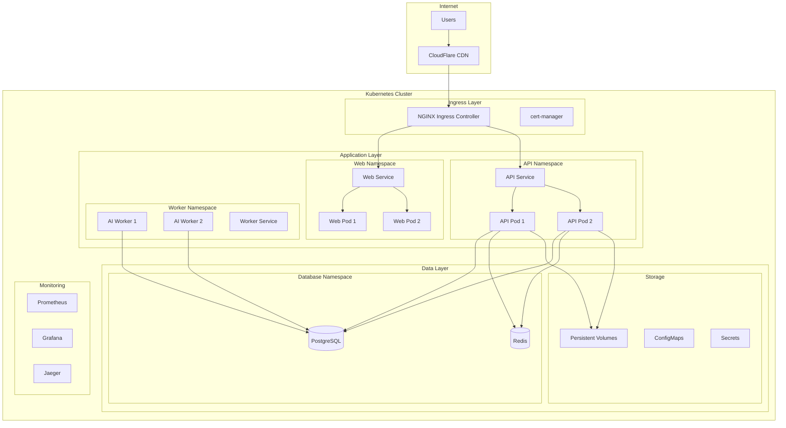

# Kubernetes Deployment Guide

## Overview

This guide covers deploying LexiScan AI on Kubernetes using modern cloud-native practices. The deployment includes auto-scaling, high availability, security, monitoring, and GitOps workflows.

## Table of Contents

- [Architecture Overview](#architecture-overview)
- [Prerequisites](#prerequisites)
- [Cluster Setup](#cluster-setup)
- [Application Deployment](#application-deployment)
- [Database Setup](#database-setup)
- [Monitoring & Observability](#monitoring--observability)
- [Security Configuration](#security-configuration)
- [Scaling & Performance](#scaling--performance)
- [Backup & Recovery](#backup--recovery)
- [GitOps Workflow](#gitops-workflow)
- [Troubleshooting](#troubleshooting)

## Architecture Overview

### High-Level Architecture



### Component Overview

| Component | Technology | Purpose |
|-----------|------------|---------|
| **Ingress** | NGINX Ingress Controller | Traffic routing, SSL termination |
| **Web App** | Next.js on Kubernetes | Frontend application |
| **API Server** | NestJS on Kubernetes | Backend API services |
| **AI Workers** | Python on Kubernetes | AI/ML processing |
| **Database** | PostgreSQL on Kubernetes | Primary data storage |
| **Cache** | Redis on Kubernetes | Session storage, caching |
| **Storage** | Persistent Volumes | File storage |
| **Monitoring** | Prometheus + Grafana | Metrics and dashboards |
| **Tracing** | Jaeger | Distributed tracing |
| **Logging** | ELK Stack | Centralized logging |

## Prerequisites

### Required Tools

1. **kubectl** - Kubernetes command-line tool
2. **helm** - Kubernetes package manager
3. **Docker** - Container runtime
4. **Terraform** - Infrastructure as code
5. **Git** - Version control

### Kubernetes Cluster Requirements

- **Kubernetes Version**: 1.24+
- **Nodes**: 3+ worker nodes
- **CPU**: 8+ cores per node
- **Memory**: 32+ GB per node
- **Storage**: 100+ GB per node

### Cloud Provider Options

| Provider | Managed Service | Benefits |
|----------|-----------------|----------|
| **AWS** | EKS | Native AWS integration |
| **Google Cloud** | GKE | Advanced networking |
| **Azure** | AKS | Enterprise features |
| **DigitalOcean** | DOKS | Cost-effective |
| **On-Premises** | Self-managed | Full control |

## Cluster Setup

### 1. EKS Cluster (AWS)

```hcl
# terraform/eks.tf
module "eks" {
  source  = "terraform-aws-modules/eks/aws"
  version = "~> 19.0"

  cluster_name    = "lexiscan-cluster"
  cluster_version = "1.24"

  vpc_id                         = module.vpc.vpc_id
  subnet_ids                     = module.vpc.private_subnets
  cluster_endpoint_public_access = true

  # EKS Managed Node Groups
  eks_managed_node_groups = {
    main = {
      name = "lexiscan-nodes"

      instance_types = ["t3.large"]

      min_size     = 2
      max_size     = 10
      desired_size = 3

      disk_size = 50
    }
  }

  # aws-auth configmap
  manage_aws_auth_configmap = true

  aws_auth_roles = [
    {
      rolearn  = "arn:aws:iam::${data.aws_caller_identity.current.account_id}:role/lexiscan-admin"
      username = "lexiscan-admin"
      groups   = ["system:masters"]
    }
  ]

  tags = {
    Environment = "production"
    Application = "lexiscan"
  }
}
```

### 2. GKE Cluster (Google Cloud)

```hcl
# terraform/gke.tf
resource "google_container_cluster" "lexiscan" {
  name     = "lexiscan-cluster"
  location = var.region

  # We can't create a cluster with no node pool defined, but we want to only use
  # separately managed node pools. So we create the smallest possible default
  # node pool and immediately delete it.
  remove_default_node_pool = true
  initial_node_count       = 1

  network    = google_compute_network.lexiscan.name
  subnetwork = google_compute_subnetwork.lexiscan.name

  # Enable Workload Identity
  workload_identity_config {
    workload_pool = "${var.project_id}.svc.id.goog"
  }

  # Enable Binary Authorization
  binary_authorization {
    evaluation_mode = "PROJECT_SINGLETON_POLICY_ENFORCE"
  }

  # Enable Network Policy
  network_policy {
    enabled = true
  }

  # Enable Pod Security Policy
  pod_security_policy_config {
    enabled = true
  }
}

resource "google_container_node_pool" "lexiscan_nodes" {
  name       = "lexiscan-node-pool"
  location   = var.region
  cluster    = google_container_cluster.lexiscan.name
  node_count = 3

  node_config {
    preemptible  = false
    machine_type = "e2-standard-2"

    # Google recommends custom service accounts that have cloud-platform scope and permissions granted via IAM Roles.
    service_account = google_service_account.lexiscan.email
    oauth_scopes = [
      "https://www.googleapis.com/auth/cloud-platform"
    ]

    metadata = {
      disable-legacy-endpoints = "true"
    }

    labels = {
      app = "lexiscan"
    }

    tags = ["lexiscan-nodes"]
  }

  autoscaling {
    min_node_count = 2
    max_node_count = 10
  }

  management {
    auto_repair  = true
    auto_upgrade = true
  }
}
```

### 3. AKS Cluster (Azure)

```hcl
# terraform/aks.tf
resource "azurerm_kubernetes_cluster" "lexiscan" {
  name                = "lexiscan-aks"
  location            = azurerm_resource_group.lexiscan.location
  resource_group_name = azurerm_resource_group.lexiscan.name
  dns_prefix          = "lexiscan"

  default_node_pool {
    name       = "default"
    node_count = 3
    vm_size    = "Standard_D2s_v3"
  }

  identity {
    type = "SystemAssigned"
  }

  network_profile {
    network_plugin = "azure"
    network_policy = "azure"
  }

  # Enable RBAC
  role_based_access_control {
    enabled = true
  }

  # Enable monitoring
  oms_agent {
    log_analytics_workspace_id = azurerm_log_analytics_workspace.lexiscan.id
  }

  tags = {
    Environment = "production"
    Application = "lexiscan"
  }
}
```

## Application Deployment

### 1. Namespace Configuration

```yaml
# k8s/base/namespace.yaml
apiVersion: v1
kind: Namespace
metadata:
  name: lexiscan
  labels:
    name: lexiscan
    app.kubernetes.io/name: lexiscan
    app.kubernetes.io/version: "1.0.0"
---
apiVersion: v1
kind: ResourceQuota
metadata:
  name: lexiscan-quota
  namespace: lexiscan
spec:
  hard:
    requests.cpu: "4"
    requests.memory: 8Gi
    limits.cpu: "8"
    limits.memory: 16Gi
    persistentvolumeclaims: "10"
---
apiVersion: v1
kind: LimitRange
metadata:
  name: lexiscan-limits
  namespace: lexiscan
spec:
  limits:
  - default:
      cpu: "1"
      memory: "2Gi"
    defaultRequest:
      cpu: "100m"
      memory: "128Mi"
    type: Container
```

### 2. ConfigMaps and Secrets

```yaml
# k8s/base/configmap.yaml
apiVersion: v1
kind: ConfigMap
metadata:
  name: lexiscan-config
  namespace: lexiscan
data:
  NODE_ENV: "production"
  PORT: "3001"
  CORS_ORIGIN: "https://lexiscan.ai"
  LOG_LEVEL: "info"
  REDIS_HOST: "redis-service"
  REDIS_PORT: "6379"
  DATABASE_HOST: "postgres-service"
  DATABASE_PORT: "5432"
  DATABASE_NAME: "lexiscan"
---
apiVersion: v1
kind: Secret
metadata:
  name: lexiscan-secrets
  namespace: lexiscan
type: Opaque
data:
  DATABASE_PASSWORD: <base64-encoded-password>
  JWT_SECRET: <base64-encoded-jwt-secret>
  REDIS_PASSWORD: <base64-encoded-redis-password>
  ENCRYPTION_KEY: <base64-encoded-encryption-key>
```

### 3. Web Application Deployment

```yaml
# k8s/deployments/web-deployment.yaml
apiVersion: apps/v1
kind: Deployment
metadata:
  name: lexiscan-web
  namespace: lexiscan
  labels:
    app: lexiscan-web
    version: v1
spec:
  replicas: 3
  selector:
    matchLabels:
      app: lexiscan-web
  template:
    metadata:
      labels:
        app: lexiscan-web
        version: v1
    spec:
      containers:
      - name: web
        image: lexiscan/web:latest
        ports:
        - containerPort: 3000
        env:
        - name: NODE_ENV
          valueFrom:
            configMapKeyRef:
              name: lexiscan-config
              key: NODE_ENV
        - name: NEXT_PUBLIC_API_URL
          value: "https://api.lexiscan.ai"
        resources:
          requests:
            cpu: "100m"
            memory: "128Mi"
          limits:
            cpu: "500m"
            memory: "512Mi"
        livenessProbe:
          httpGet:
            path: /health
            port: 3000
          initialDelaySeconds: 30
          periodSeconds: 10
        readinessProbe:
          httpGet:
            path: /ready
            port: 3000
          initialDelaySeconds: 5
          periodSeconds: 5
        securityContext:
          runAsNonRoot: true
          runAsUser: 1000
          allowPrivilegeEscalation: false
          readOnlyRootFilesystem: true
          capabilities:
            drop:
            - ALL
---
apiVersion: v1
kind: Service
metadata:
  name: lexiscan-web-service
  namespace: lexiscan
spec:
  selector:
    app: lexiscan-web
  ports:
  - port: 3000
    targetPort: 3000
    protocol: TCP
  type: ClusterIP
```

### 4. API Server Deployment

```yaml
# k8s/deployments/api-deployment.yaml
apiVersion: apps/v1
kind: Deployment
metadata:
  name: lexiscan-api
  namespace: lexiscan
  labels:
    app: lexiscan-api
    version: v1
spec:
  replicas: 3
  selector:
    matchLabels:
      app: lexiscan-api
  template:
    metadata:
      labels:
        app: lexiscan-api
        version: v1
    spec:
      containers:
      - name: api
        image: lexiscan/api:latest
        ports:
        - containerPort: 3001
        env:
        - name: NODE_ENV
          valueFrom:
            configMapKeyRef:
              name: lexiscan-config
              key: NODE_ENV
        - name: DATABASE_URL
          valueFrom:
            secretKeyRef:
              name: lexiscan-secrets
              key: DATABASE_URL
        - name: JWT_SECRET
          valueFrom:
            secretKeyRef:
              name: lexiscan-secrets
              key: JWT_SECRET
        resources:
          requests:
            cpu: "200m"
            memory: "256Mi"
          limits:
            cpu: "1000m"
            memory: "1Gi"
        livenessProbe:
          httpGet:
            path: /api/health
            port: 3001
          initialDelaySeconds: 30
          periodSeconds: 10
        readinessProbe:
          httpGet:
            path: /api/ready
            port: 3001
          initialDelaySeconds: 5
          periodSeconds: 5
        securityContext:
          runAsNonRoot: true
          runAsUser: 1000
          allowPrivilegeEscalation: false
          readOnlyRootFilesystem: true
          capabilities:
            drop:
            - ALL
---
apiVersion: v1
kind: Service
metadata:
  name: lexiscan-api-service
  namespace: lexiscan
spec:
  selector:
    app: lexiscan-api
  ports:
  - port: 3001
    targetPort: 3001
    protocol: TCP
  type: ClusterIP
```

### 5. AI Worker Deployment

```yaml
# k8s/deployments/worker-deployment.yaml
apiVersion: apps/v1
kind: Deployment
metadata:
  name: lexiscan-worker
  namespace: lexiscan
  labels:
    app: lexiscan-worker
    version: v1
spec:
  replicas: 2
  selector:
    matchLabels:
      app: lexiscan-worker
  template:
    metadata:
      labels:
        app: lexiscan-worker
        version: v1
    spec:
      containers:
      - name: worker
        image: lexiscan/worker:latest
        ports:
        - containerPort: 8000
        env:
        - name: REDIS_URL
          valueFrom:
            secretKeyRef:
              name: lexiscan-secrets
              key: REDIS_URL
        - name: OPENAI_API_KEY
          valueFrom:
            secretKeyRef:
              name: lexiscan-secrets
              key: OPENAI_API_KEY
        resources:
          requests:
            cpu: "500m"
            memory: "1Gi"
          limits:
            cpu: "2000m"
            memory: "4Gi"
        livenessProbe:
          httpGet:
            path: /health
            port: 8000
          initialDelaySeconds: 60
          periodSeconds: 30
        readinessProbe:
          httpGet:
            path: /ready
            port: 8000
          initialDelaySeconds: 30
          periodSeconds: 10
        securityContext:
          runAsNonRoot: true
          runAsUser: 1000
          allowPrivilegeEscalation: false
          readOnlyRootFilesystem: true
          capabilities:
            drop:
            - ALL
---
apiVersion: v1
kind: Service
metadata:
  name: lexiscan-worker-service
  namespace: lexiscan
spec:
  selector:
    app: lexiscan-worker
  ports:
  - port: 8000
    targetPort: 8000
    protocol: TCP
  type: ClusterIP
```

## Database Setup

### 1. PostgreSQL Deployment

```yaml
# k8s/databases/postgres-statefulset.yaml
apiVersion: apps/v1
kind: StatefulSet
metadata:
  name: postgres
  namespace: lexiscan
spec:
  serviceName: postgres-service
  replicas: 1
  selector:
    matchLabels:
      app: postgres
  template:
    metadata:
      labels:
        app: postgres
    spec:
      containers:
      - name: postgres
        image: postgres:15
        ports:
        - containerPort: 5432
        env:
        - name: POSTGRES_DB
          value: "lexiscan"
        - name: POSTGRES_USER
          value: "lexiscan"
        - name: POSTGRES_PASSWORD
          valueFrom:
            secretKeyRef:
              name: lexiscan-secrets
              key: DATABASE_PASSWORD
        volumeMounts:
        - name: postgres-storage
          mountPath: /var/lib/postgresql/data
        resources:
          requests:
            cpu: "500m"
            memory: "1Gi"
          limits:
            cpu: "2000m"
            memory: "4Gi"
        livenessProbe:
          exec:
            command:
            - pg_isready
            - -U
            - lexiscan
          initialDelaySeconds: 30
          periodSeconds: 10
        readinessProbe:
          exec:
            command:
            - pg_isready
            - -U
            - lexiscan
          initialDelaySeconds: 5
          periodSeconds: 5
  volumeClaimTemplates:
  - metadata:
      name: postgres-storage
    spec:
      accessModes: ["ReadWriteOnce"]
      resources:
        requests:
          storage: 100Gi
---
apiVersion: v1
kind: Service
metadata:
  name: postgres-service
  namespace: lexiscan
spec:
  selector:
    app: postgres
  ports:
  - port: 5432
    targetPort: 5432
    protocol: TCP
  type: ClusterIP
```

### 2. Redis Deployment

```yaml
# k8s/databases/redis-deployment.yaml
apiVersion: apps/v1
kind: Deployment
metadata:
  name: redis
  namespace: lexiscan
spec:
  replicas: 1
  selector:
    matchLabels:
      app: redis
  template:
    metadata:
      labels:
        app: redis
    spec:
      containers:
      - name: redis
        image: redis:7-alpine
        ports:
        - containerPort: 6379
        command:
        - redis-server
        - --appendonly yes
        - --maxmemory 512mb
        - --maxmemory-policy allkeys-lru
        volumeMounts:
        - name: redis-storage
          mountPath: /data
        resources:
          requests:
            cpu: "100m"
            memory: "128Mi"
          limits:
            cpu: "500m"
            memory: "512Mi"
        livenessProbe:
          exec:
            command:
            - redis-cli
            - ping
          initialDelaySeconds: 30
          periodSeconds: 10
        readinessProbe:
          exec:
            command:
            - redis-cli
            - ping
          initialDelaySeconds: 5
          periodSeconds: 5
      volumes:
      - name: redis-storage
        persistentVolumeClaim:
          claimName: redis-pvc
---
apiVersion: v1
kind: Service
metadata:
  name: redis-service
  namespace: lexiscan
spec:
  selector:
    app: redis
  ports:
  - port: 6379
    targetPort: 6379
    protocol: TCP
  type: ClusterIP
---
apiVersion: v1
kind: PersistentVolumeClaim
metadata:
  name: redis-pvc
  namespace: lexiscan
spec:
  accessModes:
  - ReadWriteOnce
  resources:
    requests:
      storage: 10Gi
```

## Monitoring & Observability

### 1. Prometheus Setup

```yaml
# k8s/monitoring/prometheus.yaml
apiVersion: v1
kind: ConfigMap
metadata:
  name: prometheus-config
  namespace: lexiscan
data:
  prometheus.yml: |
    global:
      scrape_interval: 15s
      evaluation_interval: 15s
    
    rule_files:
      - "alert_rules.yml"
    
    alerting:
      alertmanagers:
        - static_configs:
            - targets:
              - alertmanager:9093
    
    scrape_configs:
      - job_name: 'kubernetes-pods'
        kubernetes_sd_configs:
          - role: pod
        relabel_configs:
          - source_labels: [__meta_kubernetes_pod_annotation_prometheus_io_scrape]
            action: keep
            regex: true
          - source_labels: [__meta_kubernetes_pod_annotation_prometheus_io_path]
            action: replace
            target_label: __metrics_path__
            regex: (.+)
          - source_labels: [__address__, __meta_kubernetes_pod_annotation_prometheus_io_port]
            action: replace
            regex: ([^:]+)(?::\d+)?;(\d+)
            replacement: $1:$2
            target_label: __address__
          - action: labelmap
            regex: __meta_kubernetes_pod_label_(.+)
          - source_labels: [__meta_kubernetes_namespace]
            action: replace
            target_label: kubernetes_namespace
          - source_labels: [__meta_kubernetes_pod_name]
            action: replace
            target_label: kubernetes_pod_name
---
apiVersion: apps/v1
kind: Deployment
metadata:
  name: prometheus
  namespace: lexiscan
spec:
  replicas: 1
  selector:
    matchLabels:
      app: prometheus
  template:
    metadata:
      labels:
        app: prometheus
    spec:
      containers:
      - name: prometheus
        image: prom/prometheus:latest
        ports:
        - containerPort: 9090
        args:
        - '--config.file=/etc/prometheus/prometheus.yml'
        - '--storage.tsdb.path=/prometheus/'
        - '--web.console.libraries=/etc/prometheus/console_libraries'
        - '--web.console.templates=/etc/prometheus/consoles'
        - '--storage.tsdb.retention.time=200h'
        - '--web.enable-lifecycle'
        volumeMounts:
        - name: prometheus-config
          mountPath: /etc/prometheus
        - name: prometheus-storage
          mountPath: /prometheus
        resources:
          requests:
            cpu: "500m"
            memory: "1Gi"
          limits:
            cpu: "1000m"
            memory: "2Gi"
      volumes:
      - name: prometheus-config
        configMap:
          name: prometheus-config
      - name: prometheus-storage
        persistentVolumeClaim:
          claimName: prometheus-pvc
---
apiVersion: v1
kind: Service
metadata:
  name: prometheus
  namespace: lexiscan
spec:
  selector:
    app: prometheus
  ports:
  - port: 9090
    targetPort: 9090
    protocol: TCP
  type: ClusterIP
```

### 2. Grafana Setup

```yaml
# k8s/monitoring/grafana.yaml
apiVersion: apps/v1
kind: Deployment
metadata:
  name: grafana
  namespace: lexiscan
spec:
  replicas: 1
  selector:
    matchLabels:
      app: grafana
  template:
    metadata:
      labels:
        app: grafana
    spec:
      containers:
      - name: grafana
        image: grafana/grafana:latest
        ports:
        - containerPort: 3000
        env:
        - name: GF_SECURITY_ADMIN_PASSWORD
          valueFrom:
            secretKeyRef:
              name: grafana-secrets
              key: admin-password
        volumeMounts:
        - name: grafana-storage
          mountPath: /var/lib/grafana
        - name: grafana-config
          mountPath: /etc/grafana/provisioning
        resources:
          requests:
            cpu: "100m"
            memory: "128Mi"
          limits:
            cpu: "500m"
            memory: "512Mi"
      volumes:
      - name: grafana-storage
        persistentVolumeClaim:
          claimName: grafana-pvc
      - name: grafana-config
        configMap:
          name: grafana-config
---
apiVersion: v1
kind: Service
metadata:
  name: grafana
  namespace: lexiscan
spec:
  selector:
    app: grafana
  ports:
  - port: 3000
    targetPort: 3000
    protocol: TCP
  type: ClusterIP
```

### 3. Jaeger Setup

```yaml
# k8s/monitoring/jaeger.yaml
apiVersion: apps/v1
kind: Deployment
metadata:
  name: jaeger
  namespace: lexiscan
spec:
  replicas: 1
  selector:
    matchLabels:
      app: jaeger
  template:
    metadata:
      labels:
        app: jaeger
    spec:
      containers:
      - name: jaeger
        image: jaegertracing/all-in-one:latest
        ports:
        - containerPort: 16686
        - containerPort: 14268
        env:
        - name: COLLECTOR_OTLP_ENABLED
          value: "true"
        resources:
          requests:
            cpu: "100m"
            memory: "128Mi"
          limits:
            cpu: "500m"
            memory: "512Mi"
---
apiVersion: v1
kind: Service
metadata:
  name: jaeger
  namespace: lexiscan
spec:
  selector:
    app: jaeger
  ports:
  - name: ui
    port: 16686
    targetPort: 16686
    protocol: TCP
  - name: otlp
    port: 14268
    targetPort: 14268
    protocol: TCP
  type: ClusterIP
```

## Security Configuration

### 1. Network Policies

```yaml
# k8s/security/network-policies.yaml
apiVersion: networking.k8s.io/v1
kind: NetworkPolicy
metadata:
  name: lexiscan-network-policy
  namespace: lexiscan
spec:
  podSelector:
    matchLabels:
      app: lexiscan-api
  policyTypes:
  - Ingress
  - Egress
  ingress:
  - from:
    - namespaceSelector:
        matchLabels:
          name: lexiscan
    - podSelector:
        matchLabels:
          app: lexiscan-web
    ports:
    - protocol: TCP
      port: 3001
  egress:
  - to:
    - podSelector:
        matchLabels:
          app: postgres
    ports:
    - protocol: TCP
      port: 5432
  - to:
    - podSelector:
        matchLabels:
          app: redis
    ports:
    - protocol: TCP
      port: 6379
  - to: []
    ports:
    - protocol: TCP
      port: 443
    - protocol: TCP
      port: 80
```

### 2. Pod Security Policies

```yaml
# k8s/security/pod-security-policy.yaml
apiVersion: policy/v1beta1
kind: PodSecurityPolicy
metadata:
  name: lexiscan-psp
spec:
  privileged: false
  allowPrivilegeEscalation: false
  requiredDropCapabilities:
    - ALL
  volumes:
    - 'configMap'
    - 'emptyDir'
    - 'projected'
    - 'secret'
    - 'downwardAPI'
    - 'persistentVolumeClaim'
  runAsUser:
    rule: 'MustRunAsNonRoot'
  seLinux:
    rule: 'RunAsAny'
  fsGroup:
    rule: 'RunAsAny'
---
apiVersion: rbac.authorization.k8s.io/v1
kind: ClusterRole
metadata:
  name: lexiscan-psp-user
rules:
- apiGroups: ['policy']
  resources: ['podsecuritypolicies']
  verbs: ['use']
  resourceNames:
  - lexiscan-psp
---
apiVersion: rbac.authorization.k8s.io/v1
kind: ClusterRoleBinding
metadata:
  name: lexiscan-psp-binding
roleRef:
  kind: ClusterRole
  name: lexiscan-psp-user
  apiGroup: rbac.authorization.k8s.io
subjects:
- kind: ServiceAccount
  name: default
  namespace: lexiscan
```

### 3. RBAC Configuration

```yaml
# k8s/security/rbac.yaml
apiVersion: v1
kind: ServiceAccount
metadata:
  name: lexiscan-sa
  namespace: lexiscan
---
apiVersion: rbac.authorization.k8s.io/v1
kind: Role
metadata:
  namespace: lexiscan
  name: lexiscan-role
rules:
- apiGroups: [""]
  resources: ["pods", "services", "configmaps", "secrets"]
  verbs: ["get", "list", "watch", "create", "update", "patch", "delete"]
- apiGroups: ["apps"]
  resources: ["deployments", "replicasets"]
  verbs: ["get", "list", "watch", "create", "update", "patch", "delete"]
---
apiVersion: rbac.authorization.k8s.io/v1
kind: RoleBinding
metadata:
  name: lexiscan-role-binding
  namespace: lexiscan
subjects:
- kind: ServiceAccount
  name: lexiscan-sa
  namespace: lexiscan
roleRef:
  kind: Role
  name: lexiscan-role
  apiGroup: rbac.authorization.k8s.io
```

## Scaling & Performance

### 1. Horizontal Pod Autoscaler

```yaml
# k8s/autoscaling/hpa.yaml
apiVersion: autoscaling/v2
kind: HorizontalPodAutoscaler
metadata:
  name: lexiscan-api-hpa
  namespace: lexiscan
spec:
  scaleTargetRef:
    apiVersion: apps/v1
    kind: Deployment
    name: lexiscan-api
  minReplicas: 2
  maxReplicas: 10
  metrics:
  - type: Resource
    resource:
      name: cpu
      target:
        type: Utilization
        averageUtilization: 70
  - type: Resource
    resource:
      name: memory
      target:
        type: Utilization
        averageUtilization: 80
  behavior:
    scaleDown:
      stabilizationWindowSeconds: 300
      policies:
      - type: Percent
        value: 10
        periodSeconds: 60
    scaleUp:
      stabilizationWindowSeconds: 60
      policies:
      - type: Percent
        value: 50
        periodSeconds: 60
---
apiVersion: autoscaling/v2
kind: HorizontalPodAutoscaler
metadata:
  name: lexiscan-web-hpa
  namespace: lexiscan
spec:
  scaleTargetRef:
    apiVersion: apps/v1
    kind: Deployment
    name: lexiscan-web
  minReplicas: 2
  maxReplicas: 8
  metrics:
  - type: Resource
    resource:
      name: cpu
      target:
        type: Utilization
        averageUtilization: 70
  - type: Resource
    resource:
      name: memory
      target:
        type: Utilization
        averageUtilization: 80
```

### 2. Vertical Pod Autoscaler

```yaml
# k8s/autoscaling/vpa.yaml
apiVersion: autoscaling.k8s.io/v1
kind: VerticalPodAutoscaler
metadata:
  name: lexiscan-api-vpa
  namespace: lexiscan
spec:
  targetRef:
    apiVersion: apps/v1
    kind: Deployment
    name: lexiscan-api
  updatePolicy:
    updateMode: "Auto"
  resourcePolicy:
    containerPolicies:
    - containerName: api
      minAllowed:
        cpu: 100m
        memory: 128Mi
      maxAllowed:
        cpu: 2000m
        memory: 4Gi
      controlledResources: ["cpu", "memory"]
```

### 3. Cluster Autoscaler

```yaml
# k8s/autoscaling/cluster-autoscaler.yaml
apiVersion: apps/v1
kind: Deployment
metadata:
  name: cluster-autoscaler
  namespace: kube-system
spec:
  replicas: 1
  selector:
    matchLabels:
      app: cluster-autoscaler
  template:
    metadata:
      labels:
        app: cluster-autoscaler
    spec:
      containers:
      - name: cluster-autoscaler
        image: k8s.gcr.io/autoscaling/cluster-autoscaler:v1.21.0
        command:
        - ./cluster-autoscaler
        - --v=4
        - --stderrthreshold=info
        - --cloud-provider=aws
        - --skip-nodes-with-local-storage=false
        - --expander=least-waste
        - --node-group-auto-discovery=asg:tag=k8s.io/cluster-autoscaler/enabled,k8s.io/cluster-autoscaler/lexiscan-cluster
        resources:
          limits:
            cpu: 100m
            memory: 300Mi
          requests:
            cpu: 100m
            memory: 300Mi
        env:
        - name: AWS_REGION
          value: us-east-1
```

## Backup & Recovery

### 1. Database Backup

```yaml
# k8s/backup/postgres-backup.yaml
apiVersion: batch/v1
kind: CronJob
metadata:
  name: postgres-backup
  namespace: lexiscan
spec:
  schedule: "0 2 * * *"  # Daily at 2 AM
  jobTemplate:
    spec:
      template:
        spec:
          containers:
          - name: postgres-backup
            image: postgres:15
            command:
            - /bin/bash
            - -c
            - |
              pg_dump -h postgres-service -U lexiscan lexiscan > /backup/lexiscan-$(date +%Y%m%d).sql
              gzip /backup/lexiscan-$(date +%Y%m%d).sql
            env:
            - name: PGPASSWORD
              valueFrom:
                secretKeyRef:
                  name: lexiscan-secrets
                  key: DATABASE_PASSWORD
            volumeMounts:
            - name: backup-storage
              mountPath: /backup
          volumes:
          - name: backup-storage
            persistentVolumeClaim:
              claimName: backup-pvc
          restartPolicy: OnFailure
---
apiVersion: v1
kind: PersistentVolumeClaim
metadata:
  name: backup-pvc
  namespace: lexiscan
spec:
  accessModes:
  - ReadWriteOnce
  resources:
    requests:
      storage: 50Gi
```

### 2. Application Backup

```yaml
# k8s/backup/app-backup.yaml
apiVersion: batch/v1
kind: CronJob
metadata:
  name: app-backup
  namespace: lexiscan
spec:
  schedule: "0 3 * * *"  # Daily at 3 AM
  jobTemplate:
    spec:
      template:
        spec:
          containers:
          - name: app-backup
            image: alpine:latest
            command:
            - /bin/sh
            - -c
            - |
              # Backup ConfigMaps
              kubectl get configmaps -n lexiscan -o yaml > /backup/configmaps-$(date +%Y%m%d).yaml
              
              # Backup Secrets
              kubectl get secrets -n lexiscan -o yaml > /backup/secrets-$(date +%Y%m%d).yaml
              
              # Backup Deployments
              kubectl get deployments -n lexiscan -o yaml > /backup/deployments-$(date +%Y%m%d).yaml
              
              # Compress backup
              tar -czf /backup/lexiscan-backup-$(date +%Y%m%d).tar.gz /backup/*.yaml
            volumeMounts:
            - name: backup-storage
              mountPath: /backup
            - name: kubeconfig
              mountPath: /root/.kube
          volumes:
          - name: backup-storage
            persistentVolumeClaim:
              claimName: backup-pvc
          - name: kubeconfig
            configMap:
              name: kubeconfig
          restartPolicy: OnFailure
```

## GitOps Workflow

### 1. ArgoCD Setup

```yaml
# k8s/gitops/argocd.yaml
apiVersion: argoproj.io/v1alpha1
kind: Application
metadata:
  name: lexiscan-app
  namespace: argocd
spec:
  project: default
  source:
    repoURL: https://github.com/your-org/lexiscan-k8s
    targetRevision: HEAD
    path: k8s/overlays/production
  destination:
    server: https://kubernetes.default.svc
    namespace: lexiscan
  syncPolicy:
    automated:
      prune: true
      selfHeal: true
    syncOptions:
    - CreateNamespace=true
    - PrunePropagationPolicy=foreground
    - PruneLast=true
    retry:
      limit: 5
      backoff:
        duration: 5s
        factor: 2
        maxDuration: 3m
```

### 2. Flux Setup

```yaml
# k8s/gitops/flux.yaml
apiVersion: source.toolkit.fluxcd.io/v1beta1
kind: GitRepository
metadata:
  name: lexiscan-repo
  namespace: flux-system
spec:
  interval: 1m
  ref:
    branch: main
  url: https://github.com/your-org/lexiscan-k8s
---
apiVersion: kustomize.toolkit.fluxcd.io/v1beta1
kind: Kustomization
metadata:
  name: lexiscan-app
  namespace: flux-system
spec:
  interval: 5m
  sourceRef:
    kind: GitRepository
    name: lexiscan-repo
  path: "./k8s/overlays/production"
  prune: true
  validation: client
```

## Deployment Scripts

### 1. Deploy Script

```bash
#!/bin/bash
# scripts/deploy-k8s.sh

set -e

# Configuration
NAMESPACE="lexiscan"
ENVIRONMENT="production"
IMAGE_TAG="latest"

echo "Deploying LexiScan AI to Kubernetes..."

# Create namespace
kubectl create namespace $NAMESPACE --dry-run=client -o yaml | kubectl apply -f -

# Apply base configuration
kubectl apply -f k8s/base/

# Apply environment-specific configuration
kubectl apply -f k8s/overlays/$ENVIRONMENT/

# Wait for deployments to be ready
echo "Waiting for deployments to be ready..."
kubectl wait --for=condition=available --timeout=300s deployment/lexiscan-web -n $NAMESPACE
kubectl wait --for=condition=available --timeout=300s deployment/lexiscan-api -n $NAMESPACE
kubectl wait --for=condition=available --timeout=300s deployment/lexiscan-worker -n $NAMESPACE

# Check pod status
echo "Checking pod status..."
kubectl get pods -n $NAMESPACE

# Check services
echo "Checking services..."
kubectl get services -n $NAMESPACE

# Check ingress
echo "Checking ingress..."
kubectl get ingress -n $NAMESPACE

echo "Deployment completed successfully!"
```

### 2. Health Check Script

```bash
#!/bin/bash
# scripts/health-check-k8s.sh

set -e

NAMESPACE="lexiscan"

echo "Performing health checks..."

# Check pod status
echo "Checking pod status..."
kubectl get pods -n $NAMESPACE

# Check service endpoints
echo "Checking service endpoints..."
kubectl get endpoints -n $NAMESPACE

# Check ingress status
echo "Checking ingress status..."
kubectl get ingress -n $NAMESPACE

# Check HPA status
echo "Checking HPA status..."
kubectl get hpa -n $NAMESPACE

# Check resource usage
echo "Checking resource usage..."
kubectl top pods -n $NAMESPACE

# Test application endpoints
echo "Testing application endpoints..."
kubectl port-forward svc/lexiscan-web-service 3000:3000 -n $NAMESPACE &
WEB_PID=$!
sleep 5
curl -f http://localhost:3000/health || echo "Web health check failed"
kill $WEB_PID

kubectl port-forward svc/lexiscan-api-service 3001:3001 -n $NAMESPACE &
API_PID=$!
sleep 5
curl -f http://localhost:3001/api/health || echo "API health check failed"
kill $API_PID

echo "Health checks completed!"
```

### 3. Rollback Script

```bash
#!/bin/bash
# scripts/rollback-k8s.sh

set -e

NAMESPACE="lexiscan"
REVISION=$1

if [ -z "$REVISION" ]; then
  echo "Usage: $0 <revision>"
  echo "Available revisions:"
  kubectl rollout history deployment/lexiscan-web -n $NAMESPACE
  kubectl rollout history deployment/lexiscan-api -n $NAMESPACE
  exit 1
fi

echo "Rolling back to revision $REVISION..."

# Rollback web deployment
kubectl rollout undo deployment/lexiscan-web --to-revision=$REVISION -n $NAMESPACE

# Rollback API deployment
kubectl rollout undo deployment/lexiscan-api --to-revision=$REVISION -n $NAMESPACE

# Wait for rollback to complete
echo "Waiting for rollback to complete..."
kubectl rollout status deployment/lexiscan-web -n $NAMESPACE
kubectl rollout status deployment/lexiscan-api -n $NAMESPACE

echo "Rollback completed successfully!"
```

## Troubleshooting

### Common Issues

1. **Pods Not Starting**
   - Check resource limits and requests
   - Verify image availability
   - Check security contexts
   - Review pod logs

2. **Service Connectivity Issues**
   - Verify service selectors
   - Check network policies
   - Test DNS resolution
   - Review service endpoints

3. **Ingress Issues**
   - Check ingress controller status
   - Verify TLS certificates
   - Test backend connectivity
   - Review ingress rules

4. **Scaling Issues**
   - Check HPA configuration
   - Verify metrics availability
   - Review resource quotas
   - Check cluster capacity

### Debug Commands

```bash
# Check pod status
kubectl get pods -n lexiscan -o wide

# Check pod logs
kubectl logs -f deployment/lexiscan-api -n lexiscan

# Check service endpoints
kubectl get endpoints -n lexiscan

# Check ingress status
kubectl describe ingress lexiscan-ingress -n lexiscan

# Check HPA status
kubectl describe hpa lexiscan-api-hpa -n lexiscan

# Check resource usage
kubectl top pods -n lexiscan
kubectl top nodes

# Check events
kubectl get events -n lexiscan --sort-by='.lastTimestamp'

# Debug network connectivity
kubectl run debug --image=busybox -it --rm -- nslookup postgres-service.lexiscan.svc.cluster.local
```

## Cost Optimization

### 1. Resource Optimization

- Use appropriate resource requests and limits
- Implement cluster autoscaling
- Use spot instances for non-critical workloads
- Optimize image sizes

### 2. Monitoring Costs

```bash
# Check resource usage
kubectl top nodes
kubectl top pods -n lexiscan

# Check resource quotas
kubectl describe quota -n lexiscan

# Monitor cluster capacity
kubectl describe nodes
```

## Support

For Kubernetes deployment issues:

- **Email**: k8s-support@lexiscan.ai
- **Documentation**: https://docs.lexiscan.ai/deployment/kubernetes
- **Status Page**: https://status.lexiscan.ai
- **Emergency**: support@lexiscan.ai

## Changelog

| Version | Date | Changes |
|---------|------|---------|
| 1.0.0 | 2024-01-15 | Initial Kubernetes deployment guide |
| 1.1.0 | 2024-01-20 | Added monitoring and observability |
| 1.2.0 | 2024-01-25 | Enhanced security configuration |
| 1.3.0 | 2024-02-01 | Added GitOps workflow |
